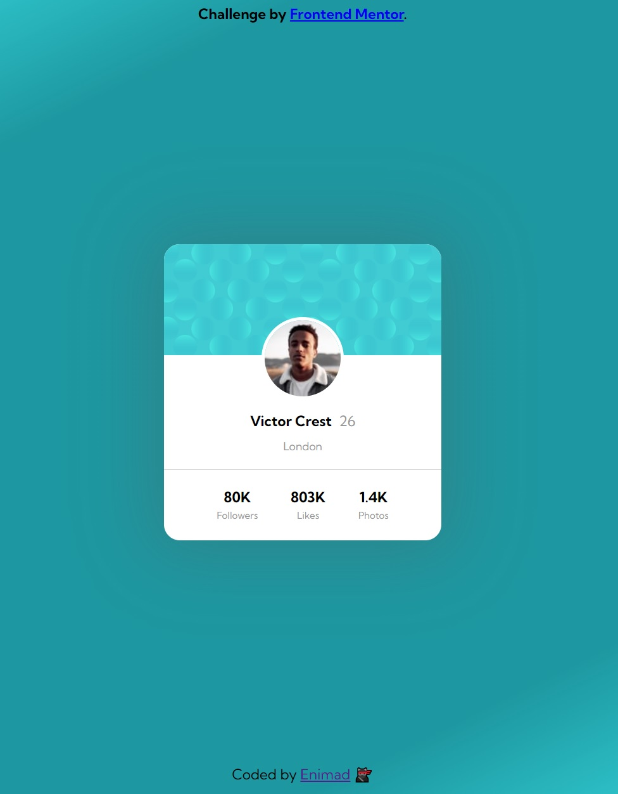

# Frontend Mentor - Profile card component solution

This is a solution to the [Profile card component challenge on Frontend Mentor](https://www.frontendmentor.io/challenges/profile-card-component-cfArpWshJ). Frontend Mentor challenges help you improve your coding skills by building realistic projects.

## Table of contents

- [Overview](#overview)
  - [Screenshot](#screenshot)
  - [Links](#links)
- [My process](#my-process)
  - [Built with](#built-with)
  - [Useful resources](#useful-resources)

## Overview

The challenge is to build out a Profile card component (based on an image) and get it looking as close to the template as possible.

### Screenshot

### Links

- Solution URL: https://github.com/enimad/Profile-card-component
- Live Site URL: https://enimad.github.io/Profile-card-component/

## My process

HTML:

- I created the structure in order to make it easily responsive if needed

CSS:

- I created all the styling in order to get as close as possible to the templates. I used Sass to style the html.

### Built with

- Semantic HTML5 markup
- CSS custom properties
- Flexbox
- Sass

### Useful resources

- https://grafikart.fr/formations/sass-preprocesseur - This helped me with Sass. There are a lot to know and everything from Grafikart feels like golden knowledge.
